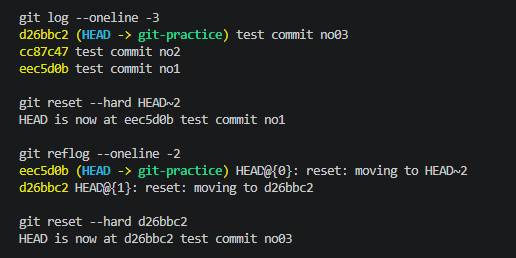

# ★ Git Archaeology Reflection // TASK 1:

I walked through one of my old commits using `git cat-file` and honestly expected Git internals to look way more complicated than they actually did. Seeing the chain from commit → tree → blob made Git feel less "weird" and more like a very organized graph of pointers. The cool part is that everything seems to be just tiny files pointing to something else (something that sounds too simple for Git :p)

After checking the commit object itself, I could see the parent commit, tree hash, author information, and commit message. Then moving into the tree object showed how Git stores directory contents internally, and finally the blob represented the actual file contents.

---

# ★ Reflog Rescue Drill // TASK 2:



---

# ★ Refactor Commit History // TASK 3:

I created a practice branch containing multiple messy commits and cleaned the history using interactive rebase.

The rebase included:
- rewriting commit messages to follow Conventional Commits
- squashing redundant commits using `fixup`
- cleaning the branch history before force pushing

Final commit:

```text
chore(git): add interactive rebase practice commits
```

[Branch with cleaned history](https://github.com/mariamanbar/bast-space/tree/rebase-practice)
